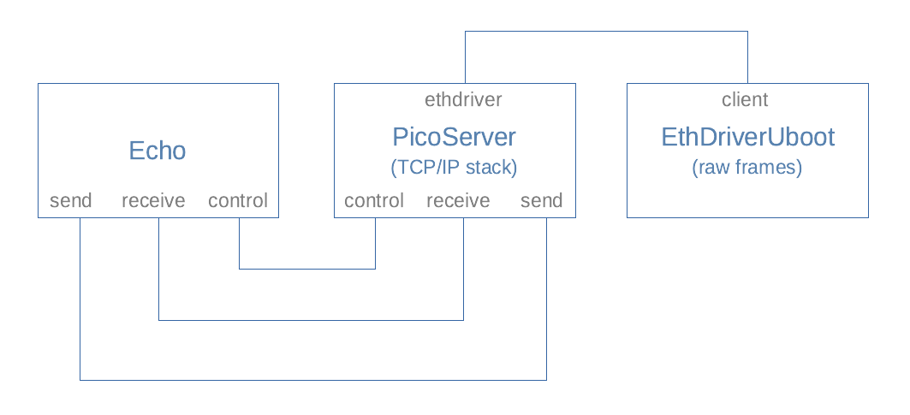

# Test application: `picoserver_uboot`

The picoserver_uboot test application has only been built using the camkes framework.

## Overview of the `picoserver_uboot` test application

It is not the purpose of this developer kit to give a CAmkES tutorial (e.g. see [seL4's documentation](https://docs.sel4.systems/projects/camkes/)), but this application is based on the following CAmkES model:



EthDriverUboot is a simple implementation of an Ethernet driver that has been ported from U-Boot. PicoServer provides a picoTCP TCP/IP stack on top of this, and the Echo component simply listens on port 1234 of a given IP address, echoing received characters on the display. (An additional component TimeServer has been omitted from the diagram for clarity, but see the [case study application](../camkes_case_study_application/main.md) for more details.)

## Instructions for running `picoserver_uboot`

As usual, this assumes that the user is already running a the CAmkES docker container within the [build environment](../../install_and_configure/build_environment_setup.md), where we can create a directory and clone the code and dependencies.

```text
mkdir /host/uboot_pico
cd /host/uboot_pico
```

```bash
repo init -u https://github.com/sel4devkit/camkes-manifest.git
```

```bash
repo sync
```

From the `/host/uboot_pico` directory, execute the following commands:

```text
mkdir build
cd build
```

```bash
../init-build.sh -DCAMKES_APP=picoserver_uboot -DPLATFORM=maaxboard -DSIMULATION=FALSE -DPICOSERVER_IP_ADDR=xxx.xxx.xxx.xxx
ninja
```

where `xxx.xxx.xxx.xxx` is the IP address to allocate to the MaaXBoard.

A successful build will result in an executable file called `capdl-loader-image-arm-maaxboard` in the `images` subdirectory. This should be copied to a file named `sel4_image` and then made available to the preferred loading mechanism, such as TFTP, as per [Execution on Target Platform](execution_on_target_platform.md).

When the `picoserver_uboot` application is running on the MaaXBoard, it should confirm that it is listening on port 1234 of the supplied IP address. It will also confirm registration of the protocol stack layers. The application allocates a random MAC address.

At any time while running, the application may display `No such port ....` messages as it monitors traffic on the network; this is expected behaviour that may be ignored.

Meanwhile, from a terminal window on the host machine, use the `netcat` (`nc`) command (native to Linux or macOS, or available as a [download](https://nmap.org/ncat/) for Windows), where `xxx.xxx.xxx.xxx` is the IP address of the MaaXBoard, as previously specified:

```bash
nc xxx.xxx.xxx.xxx 1234
```

On the MaaXBoard (via CoolTerm as usual), a message like the following should be seen:

```text
echo: Connection established with yyy.yyy.yyy.yyy on socket 1
```

where `yyy.yyy.yyy.yyy` is the IP address of the host machine.

From the host machine's terminal, strings may be typed until `nc` is terminated with Ctrl-C:

```bash
hostmachine ~ % nc 192.168.0.111 1234
Hello world!
Goodbye
^C
hostmachine ~ %
```

Each time carriage return is entered, the `picoserver_uboot` application will display the string, until the `nc` session is terminated, upon which the connection will be closed:

```text
echo: Connection established with 192.168.0.11 on socket 1
echo: Received message of length 13 --> Hello world!
echo: Received message of length 8 --> Goodbye
echo: Connection closing on socket 2
echo: Connection closed on socket 2
```

Connections can be re-established simply by issuing another `nc` command.

### Implementation note

Connecting, disconnecting, and reconnecting to a network can give rise to delays in the order of a few minutes while the elements in the network handshake and resynchronise, particularly in the case of our application, which assigns a random MAC address to the same IP address each time it runs. If the connection is not established promptly, the easiest remedial options are:

- Start from a clean reboot of the host machine (which will include flushing its DNS cache); or
- Be patient! (If you are prepared to wait for a few minutes, the connection will be made. Note that `nc` may timeout after a while if no connection is made, so the command would need to be repeated.)