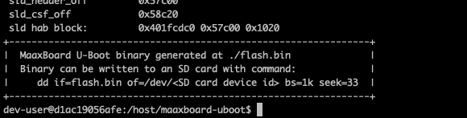

# Building U-Boot manually 

The instructions for [formatting the SD card](#partitioning-the-sd-card), [building U-Boot](#building-u-boot) and [flashing the image](#writing-u-boot-to-the-sd-card) are as follows:
## Partitioning the SD Card

The SD card must be partitioned correctly in order to contain U-Boot, seL4 and space for a filesystem. This can be done as follows.

The intention of this section is provide instructions on how to create three partitions on the disk:

- a 10 megabyte bootloader partition for U-Boot;

- a 256 megabyte partition to hold the seL4 image; and,

- the remainder of the disk is provided for the file system.

### macOS Instructions

1. Connect your SD card reader to your host machine and insert your SD card.

2. Find the disk identifier (e.g `/dev/disk6` ) for your SD card, on macOS this can be done by running `diskutil list` . This command should present a list of disks and their partitions, `/dev/disk0` and `/dev/disk1` are usually used for the internal SSD/HDD on your Mac, so the SD card will usually be at the bottom, assuming it was the last storage device attached to your machine.

3. On macOS, you may need to unmount any volumes associated with the SD card. You can do this either from Disk Utility or by using `diskutil unmount /dev/diskXsY` where `X` is the disk identifier and `Y` is the volume identifier.

4. From terminal run the following command, replacing X in `/dev/diskX` with your disk identifier as found earlier. *Note: the `15GB` size mentioned for the `FILESYS` partition can be changed to `R` which will use the remainder of the disk. The instructions here use `15GB` to reflect what was used to create the prebuilt images in the [maaxboard-prebuilt](https://github.com/sel4devkit/maaxboard-prebuilt) repo. `15GB` is used as "16GB" SD cards/flash drives are not all truly "16GB" due to formatting, so this is done to account for minor differences in size.*

   ```sh
   sudo diskutil partitionDisk /dev/diskX 3 MBR \
      FREE Bootloader 10M \
      FAT32 BOOT 256M \
      FAT32 FILESYS 15GB
   ```

### Linux Instructions

1. Connect your SD card reader to your host machine and insert your SD card.

2. Find the disk identifier (e.g `/dev/sdb` ) for your SD card, on Linux this can be done by examining the kernel ring buffer following insertion of the SD card by running `dmesg | tail` . For example, the following `dmesg` output shows the inserted card using identifier `sdb` and having two volumes `sdb1` and `sdb2`.

   ```text
   [0.711] scsi host6: usb-storage 2-1.5:1.0
   [0.728] scsi 6:0:0:0: Direct-Access   SD/MMC   Card  Reader   1.00 PQ: 0 ANSI: 0
   [0.735] sd 6:0:0:0: Attached scsi generic sg2 type 0
   [1.020] sd 6:0:0:0: [sdb] 30883840 512-byte logical blocks: (15.8 GB/14.7 GiB)
   [1.022] sd 6:0:0:0: [sdb] Write Protect is off
   [1.022] sd 6:0:0:0: [sdb] Mode Sense: 03 00 00 00
   [1.025] sd 6:0:0:0: [sdb] No Caching mode page found
   [1.025] sd 6:0:0:0: [sdb] Assuming drive cache: write through
   [1.076]  sdb: sdb1 sdb2
   [1.084] sd 6:0:0:0: [sdb] Attached SCSI removable disk
   ```

3. On Linux, you may need to unmount any volumes associated with the SD card. You can do this using the `umount` command. If two volumes named `sdb1` abd `sdb2` were detected on insertion of the SD card these would be unmounted with the following commands:

   ```sh
   sudo umount /dev/sdb1
   sudo umount /dev/sdb2
   ```

4. From terminal run the following commands, replacing `<disk>` in `/dev/<disk>` with your disk identifier as found earlier. *Note: the `14602MiB` size mentioned for the final partition can be changed to `100%` which will use the remainder of the disk. `14602MiB` is used as "16GB" SD cards/flash drives are not all truly "16GB" due to formatting, so this is done to account for minor differences in size.*

   ```sh
   sudo parted /dev/<disk> mklabel msdos
   sudo parted /dev/<disk> mkpart primary fat32 10MiB 266MiB
   sudo parted /dev/<disk> mkpart primary fat32 266MiB 14602MiB
   sudo mkfs.vfat /dev/<disk>1 -F 32 -n BOOT
   sudo mkfs.vfat /dev/<disk>2 -F 32 -n FILESYS
   ```

## Building U-Boot

In order to build U-Boot, the seL4devkit Docker build environment is required, please see [Build Environment Setup](build_environment_setup.md) to setup this up if you haven't already done so.

1. In a suitable location on your host machine, create a new directory with a relevant name, e.g. `maaxboard-uboot-build`

2. Using a terminal, run the following command to start the seL4devkit Docker environment, changing `/your/working/folder/path/here` to the absolute path of the folder you just created:

    - `docker run -it --rm -v /your/working/folder/path/here:/host:z ghcr.io/sel4devkit/maaxboard:latest`

    - For more information on starting the seL4devkit build environment, refer to the [usage section of 'Build Environment Setup'](build_environment_setup.md#usage).

3. Once the bash shell in your build environment has loaded, you can now clone the [maaxboard-uboot](https://github.com/sel4devkit/maaxboard-uboot) repository from `https://github.com/sel4devkit/maaxboard-uboot.git` using git.

4. Once git has successfully cloned the repository, a new folder called `maaxboard-uboot` should be created, containing a README file, some build scripts, and a `firmware` folder.

5. Once you have verified you have the correct files, run the main build script using `./build.sh` (the other build scripts are used if [building offline](#appendix-2)).

6. `build.sh` will clone a number of git repositories and extract necessary files from them (see the [appendix](#appendix) for an explanation of the build script), after which you will be presented with a license agreement for the NXP firmware for the i.MX8. You can navigate this agreement with the up and down arrow keys. Assuming you are happy to accept the agreement, type `y` to accept when prompted. *Note: if you decline the EULA, the build process will be terminated, since the firmware is required to build U-Boot.*

7. After the script has completed the build process, if successful you should see the following:


    *Note: During compilation of U-Boot the following spurious warning is generated and can be safely ignored:* `WARNING 'lpddr4_pmu_train_1d_imem.bin' not found, resulting binary is not-functional`.

8. The generated `flash.bin` file is now ready to write to storage media.


## Writing U-Boot to the SD card

1. Navigate to the folder containing your U-Boot `flash.bin` file. 

    > **WARNING: The next step uses the `dd` command line utility, which is used for writing images to disks. IT WILL OVERWRITE ANY DATA ON THE DISK IT IS SPECIFIED TO WRITE TO! Improper usage WILL cause data loss, corruption and potentially render your system inoperable. Please ensure you are familiar with the use of the command, as well as the disk identifiers on your system, and that you are writing to the disk you intend to, and not your system drive!**

2. From that folder run the following command, replacing `/dev/diskX` with the disk identifier of your SD card. You may be asked to enter your password.

    ```sh
    sudo dd if=flash.bin of=/dev/diskX bs=1k seek=33
    ```

3. The image should now be written to your SD card and should be bootable by the MaaXBoard.


## Appendix 

### Understanding build.sh

Whilst an understanding of how the build script ([`build.sh`](https://github.com/sel4devkit/maaxboard-uboot/blob/main/build.sh)) functions is not required for most use cases, such information is useful in case the developer has a need to modify the script. For example, it may be necessary to adapt the script for a different board or to update the script to use a different version or fork of U-Boot.

This section seeks to document the origins of the script and provide guidance on potential modifications.

#### Origin and rationale

The steps performed by the build script mirror, and are distilled from, those performed by the much more complex build script [`mk-imx-boot.sh`](https://github.com/Avnet/uboot-imx/blob/maaxboard_v2020.04_5.4.24_2.1.0/mk-imx-boot.sh) provided by the Avnet U-Boot fork.

The `build.sh` build script was produced to:

1. Remove much of the complexity of the `mk-imx-boot.sh` script, cutting it down to the bare minimum required to support the MaaXBoard, thereby making the required build steps clear; and

2. Ensure that the build script only uses resources held within the development kit GitHub account, thereby ensuring that the ability to build a known-working U-Boot cannot be broken by changes to upstream repositories.

#### Build steps

To build U-Boot for the MaaXBoard, and indeed any board, the following resources are generally required:

- A version of U-Boot with drivers supporting the board and a configuration file targeting the board. This will typically be either the U-Boot mainline or a fork of U-Boot provided by the board manufacturer.

- Firmware for the board hardware, e.g. to initialise and configure hardware such as the memory. This will typically be supplied by the board or SoC manufacturer.

- Firmware for the processor. In the case of an ARM-based SoC, such as the i.MX8MQ used on the MaaXBoard, this is the ATF (ARM Trusted Firmware).

- A tool to compose all of the required elements (e.g. compiled U-Boot binaries and firmware blobs) into the structure and layout expected by the board at boot. In the case of i.MX-based SoCs this tool is [`imx-mkimage`](https://github.com/sel4devkit/imx-mkimage).

To satisfy the requirements above, the build script performs the following steps[^note]:

1. Clones a copy of the U-Boot sources that support the MaaXBoard.

2. Clones a copy of the ATF (ARM Trusted Firmware).

3. Clones a copy of the source code of the `imx-mkimage` tool.

4. Configures U-Boot build system for the MaaXBoard and then compiles the U-Boot binaries.

5. Decompresses and compiles the DDR PHY and HDMI firmware.

6. Compiles the ATF configured for the i.MX8MQ SoC as used by the MaaXBoard.

7. Copies all of the binaries and firmware elements produced in the earlier steps into the locations expected by `imx-mkimage`.

8. Builds and executes `imx-mkimage` configured for the i.MX8MQ SoC in 'headless' mode.

[^note]: These steps are factored into the `clone.sh` and `build-offline.sh` scripts called by `build.sh`.

The build steps, if successful, result in a binary named `flash.bin` which is suitable for booting the MaaXBoard if placed in a specific location on an SD card as documented within the section [partitioning the SD card](#partitioning-the-sd-card).

#### Modifying the build script

Given the detailed explanation of the steps performed by the build script above, it is expected that modifying the script should be relatively straightforward.

Whilst the build steps and their ordering is expected to remain unchanged, the contents of each of those steps can easily be changed, for example:

- The locations of Git repositories and the branch cloned by the script can be modified.

- The version of the [firmware](https://github.com/sel4devkit/maaxboard-uboot/tree/main/firmware) supplied by NXP can be changed.

- The choices of configuration options and firmware to be included can be changed.

It is expected that such changes would be made within a fork of the [`maaxboard-uboot`](https://github.com/sel4devkit/maaxboard-uboot) Git repository that provides the build script and folder structure supporting the build.

## Appendix 2

### Building U-Boot offline

1. On a computer with an internet connection, clone the maaxboard-uboot repository using:

    ```text
    git clone https://github.com/sel4devkit/maaxboard-uboot.git
    ```

2. Run the `clone.sh` script to download the required files for building U-Boot.

3. When the clone is complete, the following message is shown:

    ```text
    +----------------------------------------------------------------+
    |  Source code for compiling U-Boot now cloned.                  |
    |  This folder can now be transferred to an offline computer     |
    |  and U-Boot built by running build-offline.sh.                 |
    |  If you ran build.sh, build will start now.                    |
    +----------------------------------------------------------------+
    ```

4. The cloned repository folder can be transferred to an offline machine, and built within the Docker container using `build-offline.sh`.