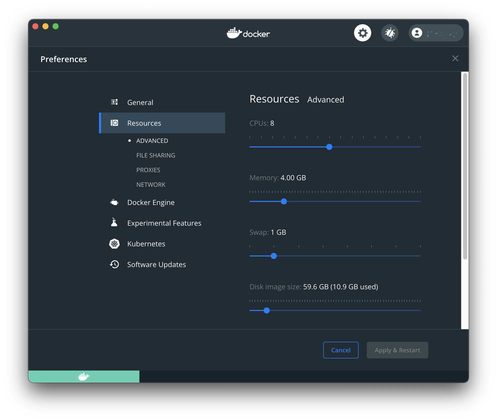
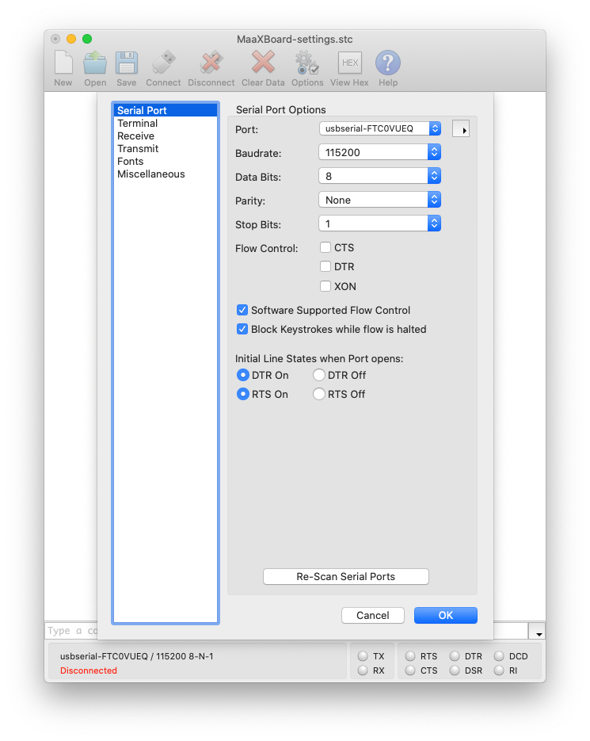
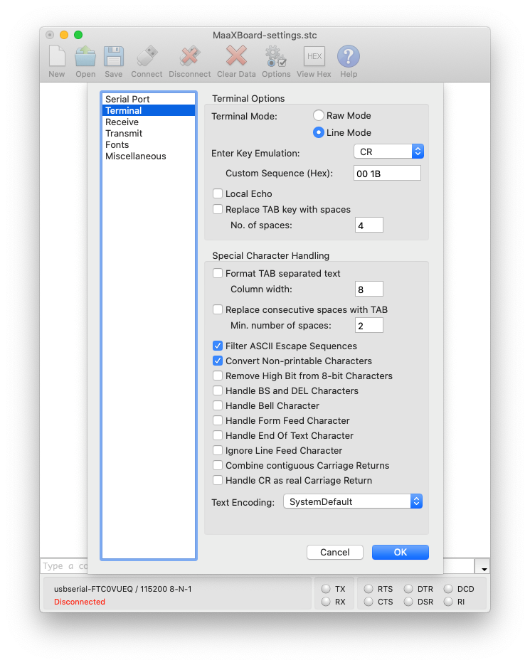

# Host Setup

The previous [Software Requirements](../development_platform/software_requirements.md) section listed the applications required on the host machine. Installation links provided there should be followed, where applicable. This section covers any necessary configuration.

## Docker Desktop / Docker Engine

Docker Desktop is a widely used platform for developing, packaging, and running applications. If you are a new Docker user, you will have to sign up for an account. Depending on your situation, a subscription fee may be applicable (typically if you are acting as a member of a large commercial organisation), but in many cases there is no cost. This development kit documentation does not attempt to guide you about this; please refer to the licensing conditions on [Docker's website](https://www.docker.com/pricing).

Little configuration of the default setup for Docker is required. Using the Docker Desktop application available for macOS and Windows, the following _Settings > Preferences_ have been found to be sufficient where the RAM setting was increased from a lower default:



When using Linux, the user running the Docker Engine needs to be made a member of the `docker` group by issuing the following command, substituting your username for `<username>`:

```bash
sudo usermod -aG docker <username>
```

## Etcher

Although [Etcher](https://www.balena.io/etcher/) is assumed and used in some of this developer kit documentation, its core functionality is available at the macOS, Linux, or Windows command line, so it is not strictly necessary if you prefer other methods.

No special configuration is necessary for Etcher.

## CoolTerm

CoolTerm enables the host machine to communicate with the MaaXBoard over the serial interface using the UART pins on the board's GPIO connector (see [Target Platform Setup](target_setup.md) section for more details of the necessary connections). Alternative applications are available, but this documentation will use CoolTerm, which is freely available and multi-platform.

The configuration parameters are accessible via the _Connection > Options_ menu. The following serial port parameters are required (i.e. 115200 baud, 8 data bits, no parity, 1 stop bit):



Note: within the _Port_ field, an appropriate USB port on the host machine should be selected; it may differ from the example shown above in the screenshot.

The following terminal parameters are suggested:



Users may also wish to extend the size of the _Receive Buffer_ to be able to scroll back through a longer history. This is accessible via the _Receive_ sub-option within the _Connection > Options_ menu.

All these settings may be saved for convenience as a CoolTerm configuration file.

## Minicom 

Minicom can also be used to communicate with the maaxboard over the serial interface using the UART pins on the board's GPIO connector (see [Target Platform Setup](target_setup.md) section for more details of the necessary connections). Minicom can be used on linux machines or on Windows with the PuTTY application. Instructions for installing and running minicom are [here](https://wiki.emacinc.com/wiki/Getting_Started_With_Minicom). 

