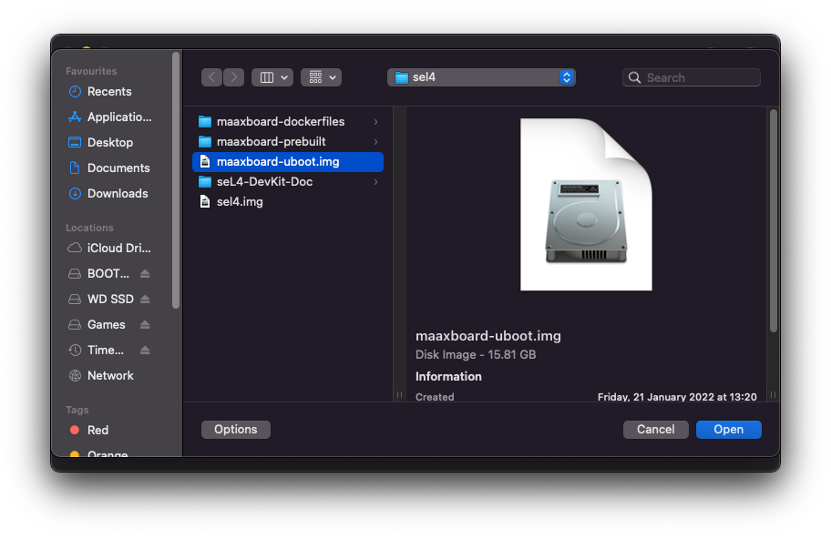
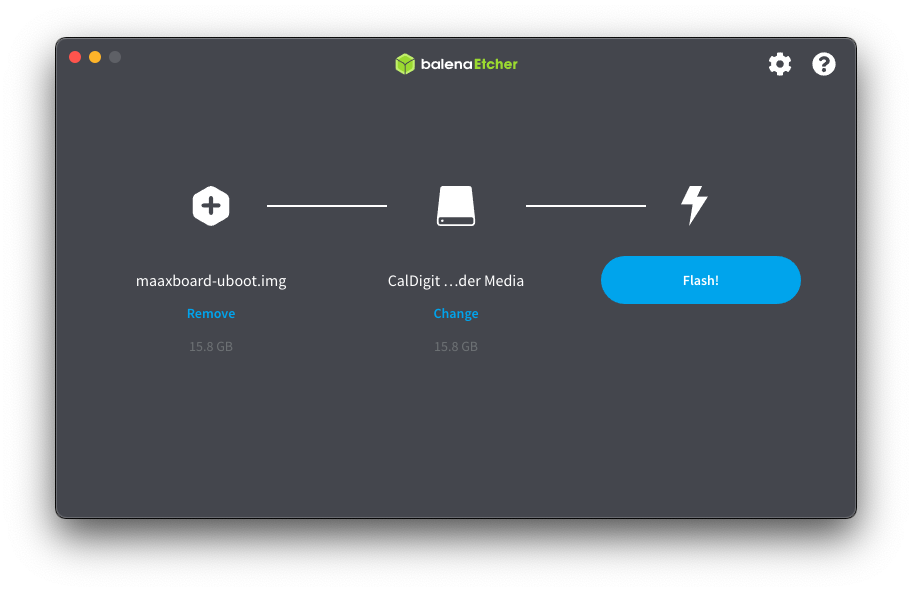
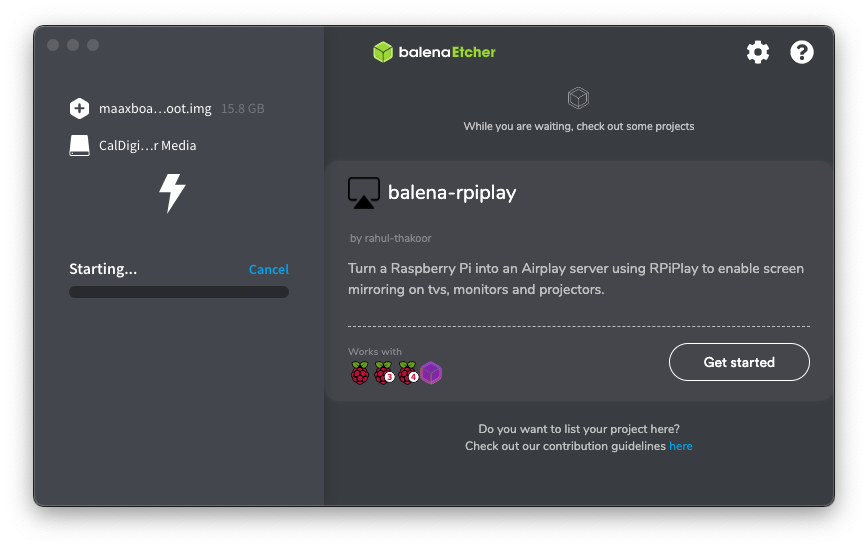

# Using the prebuilt image

## SD Card preparation

The SD card must be partitioned correctly in order to contain U-Boot and partitions to hold a binary / kernel plus additional filesystem. For convenience, a prebuilt disk image is provided. _Note: the disk images have been created for a 16GB SD card; please use a card that is 16GB or larger._

1. Get the prebuilt disk image from the [maaxboard-prebuilt](https://github.com/sel4devkit/maaxboard-prebuilt) repository, either by cloning the entire repository, or by using the direct link [here](https://github.com/sel4devkit/maaxboard-prebuilt/raw/master/disk_images/maaxboard-uboot.img.zip).

    _Note: the images are compressed as zip files in order to reduce their size (compressed size ~15MB, uncompressed size ~15GB), and will need to be uncompressed using a suitable utility before use._

2. Once you have downloaded the image you will need to use a utility for flashing images to external drives. The rest of this section assumes that you will use Etcher; see the [Host Machine Setup](host_setup.md) section for more details.

3. Insert the SD card you wish to flash, and open Etcher.

4. Select Flash from file, and navigate to and select the image file you wish to flash. Then click open.

5. Click select target and select the drive you wish to flash, taking care to choose the right drive.

6. Then finally click ‘Flash!’ to flash the image. This may take a significant time (e.g. 25 minutes).

_Flashing in progress:_

_After Etcher has flashed the disk, it will validate the disk:_

7. Once flashing is complete, the SD card is ready for use in the MaaXBoard for booting as far as the U-Boot bootloader.

## Setting up U-Boot config

A U-Boot configuration file is contained within the provided image. It is placed in the root of the `BOOT` partition and is named `uEnv.txt`; this file was introduced in a [previous section](bootloader.md#u-boot-configuration-file). It contains 3 main configurable items:

1. U-Boot network configuration (`ipaddr` and `netmask`): use this to manually configure the IP address and subnet for U-Boot to use, or comment them out to have them assigned by DHCP/BootP.

2. TFTP server IP address (`serverip`): use this to configure the IP address of the TFTP server to contact, or comment out to disable boot via TFTP.

3. ELF binary name (`elf_binary_file`): the name of the ELF binary the U-Boot will try to load, first from a USB device, then from a SD card, and finally via the configured TFTP server.

